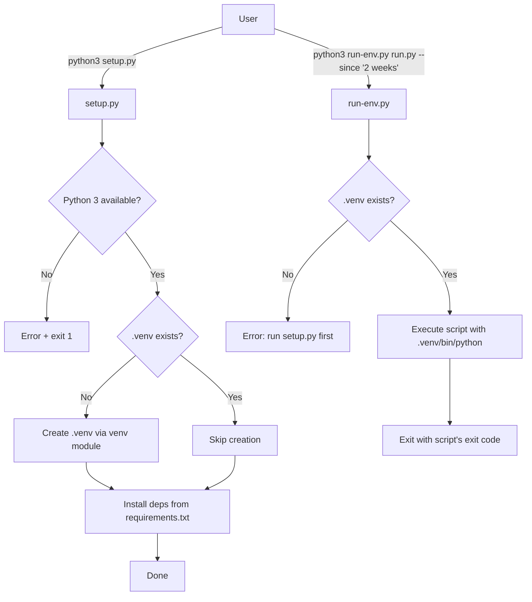

# Design Document: Dependency Isolation

## Overview

This feature introduces dependency isolation to the git-metrics project using Python's built-in `venv` module. It adds two new scripts to the project root:

1. **`setup.py`** — Creates a `.venv` virtual environment and installs dependencies from `requirements.txt`.
2. **`run-env.py`** — A runner script that executes any git-metrics script using the `.venv` Python interpreter, removing the need for manual activation.

Both scripts are written in Python (using only the standard library) to maintain cross-platform compatibility without requiring a shell interpreter. They follow the project's existing flat structure and self-contained script conventions.

### Design Decisions

- **Python scripts over shell scripts**: Shell scripts (`.sh`/`.bat`) would require separate files per platform. Python scripts work on all platforms with a single file and align with the project's existing conventions.
- **No packaging (pyproject.toml, setup.cfg)**: The project is intentionally flat with no package structure. Adding packaging infrastructure would be over-engineering for a tool that runs scripts directly.
- **Naming**: `setup.py` is chosen for the setup script (the project has no packaging, so there's no conflict with setuptools). `run-env.py` is chosen for the runner to distinguish it from the existing `run.py`.

## Architecture



## Components and Interfaces

### setup.py

**Responsibilities:**
- Detect the operating system and resolve the correct Python executable name
- Verify Python 3 is available on the system
- Create `.venv` directory using `venv.create()` if it doesn't already exist
- Install dependencies from `requirements.txt` using the venv's pip

**Interface:**
```
python3 setup.py
```

No arguments. Exits with code 0 on success, non-zero on failure.

**Internal functions:**

| Function | Purpose |
|----------|---------|
| `detect_platform()` | Returns platform info: python executable name and venv interpreter path |
| `check_python()` | Verifies the system Python 3 is available |
| `create_venv(venv_dir)` | Creates the virtual environment using `venv` module |
| `install_dependencies(venv_python, requirements_file)` | Runs pip install within the venv |
| `main()` | Orchestrates the setup flow |

### run-env.py

**Responsibilities:**
- Verify `.venv` exists before attempting execution
- Resolve the correct venv Python interpreter path for the current OS
- Execute the target script with all passed arguments
- Propagate the target script's exit code

**Interface:**
```
python3 run-env.py <script> [args...]
```

Exits with the target script's exit code, or non-zero on runner errors.

**Internal functions:**

| Function | Purpose |
|----------|---------|
| `detect_platform()` | Returns the venv interpreter path for the current OS |
| `main()` | Validates arguments, checks venv existence, executes target script |

## Data Models

This feature does not introduce persistent data models. The relevant data structures are:

### Platform Configuration (runtime)

```python
# Resolved at runtime based on sys.platform
platform_config = {
    "python_cmd": "python3",        # or "python" on Windows
    "venv_python": ".venv/bin/python",  # or ".venv/Scripts/python.exe" on Windows
}
```

### Dependency Installation Result (stdout)

The setup script outputs a summary after installation:

```
Setup complete: X package(s) installed, Y package(s) already satisfied.
```

### File System Artifacts

| Artifact | Location | Purpose |
|----------|----------|---------|
| Virtual environment | `.venv/` | Isolated Python + installed packages |
| Gitignore entry | `.gitignore` | Prevents `.venv` from being committed |

## Correctness Properties

*A property is a characteristic or behavior that should hold true across all valid executions of a system — essentially, a formal statement about what the system should do. Properties serve as the bridge between human-readable specifications and machine-verifiable correctness guarantees.*

### Property 1: Platform detection returns consistent configuration

*For any* value of `sys.platform`, `detect_platform()` should return either a valid Unix-like configuration (`python_cmd="python3"`, `venv_python=".venv/bin/python"`) for platforms starting with `"linux"` or `"darwin"`, a valid Windows configuration (`python_cmd="python"`, `venv_python=".venv/Scripts/python.exe"`) for platforms starting with `"win"`, or raise an error for unrecognized platforms. The function should never return a mixed configuration (e.g., Unix executable with Windows path).

**Validates: Requirements 6.1, 6.2**

### Property 2: Exit code propagation

*For any* integer exit code in the range 0–255 returned by a child process, the runner script should exit with that same exit code.

**Validates: Requirements 3.1**

### Property 3: Argument passthrough preserves all arguments

*For any* list of command-line argument strings (including strings with spaces, special characters, and flags), the runner script should pass them to the subprocess call without modification — the subprocess should receive exactly the same argument list.

**Validates: Requirements 3.3**

### Property 4: Pip output summary parsing produces correct counts

*For any* pip install output containing a mix of "Successfully installed" and "Requirement already satisfied" lines, the summary parsing function should report counts that exactly match the number of each type of line in the input.

**Validates: Requirements 2.5**

## Error Handling

| Scenario | Behavior | Exit Code |
|----------|----------|-----------|
| Python 3 not found on system | Print error naming the expected executable (`python3` or `python`) | 1 |
| Unsupported operating system | Print error with the detected `sys.platform` value | 1 |
| `requirements.txt` missing | Print error: "requirements.txt not found" | 1 |
| Package installation fails | Print error identifying the failed package | 1 (pip's exit code) |
| `.venv` missing when runner invoked | Print error: "Virtual environment not found. Run: python3 setup.py" | 1 |
| Runner invoked without script name | Print usage message: "Usage: python3 run-env.py <script> [args...]" | 1 |
| Target script not found | Let subprocess error propagate (FileNotFoundError) | 1 |

**Error output**: All error messages go to `stderr` via `print(..., file=sys.stderr)`. Normal progress messages go to `stdout`.

**Design principle**: Fail fast and clearly. Each error message should tell the user what went wrong and what to do about it.

## Testing Strategy

### Unit Tests (unittest)

Unit tests cover specific scenarios and error conditions using mocks:

- `test_setup_skips_creation_when_venv_exists` — verifies venv.create() is not called
- `test_setup_errors_when_python_missing` — verifies error message and exit code
- `test_setup_errors_when_requirements_missing` — verifies error message and exit code
- `test_setup_errors_on_unsupported_platform` — verifies error message and exit code
- `test_runner_errors_when_venv_missing` — verifies error message and exit code
- `test_runner_errors_without_script_name` — verifies usage message
- `test_runner_errors_when_executable_not_found` — verifies error propagation

### Property-Based Tests (Hypothesis)

Property-based tests use the [Hypothesis](https://hypothesis.readthedocs.io/) library to verify universal properties across generated inputs. Each test runs a minimum of 100 iterations.

| Test | Property | Tag |
|------|----------|-----|
| `test_platform_detection_consistency` | Property 1 | Feature: dependency-isolation, Property 1: Platform detection returns consistent configuration |
| `test_exit_code_propagation` | Property 2 | Feature: dependency-isolation, Property 2: Exit code propagation |
| `test_argument_passthrough` | Property 3 | Feature: dependency-isolation, Property 3: Argument passthrough preserves all arguments |
| `test_pip_output_summary_parsing` | Property 4 | Feature: dependency-isolation, Property 4: Pip output summary parsing produces correct counts |

**Hypothesis configuration:**
```python
from hypothesis import settings

@settings(max_examples=100)
```

### Integration Tests

A small set of integration tests verify end-to-end behavior in a temporary directory:

- `test_full_setup_creates_working_venv` — runs setup.py, verifies .venv is functional
- `test_runner_executes_script_in_venv` — runs run-env.py with a simple test script

### Test Dependencies

Add to a `requirements-dev.txt` (not installed in production venv):
```
hypothesis>=6.0.0
```

Run property tests:
```
python3 -m pytest test_setup.py -v
```

Or with unittest discovery:
```
python3 -m pytest test_setup.py -v --hypothesis-show-statistics
```

